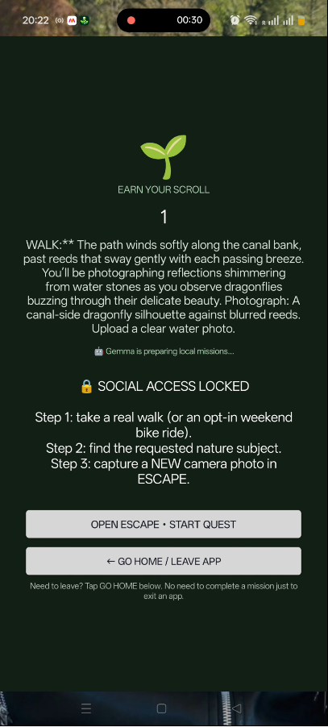
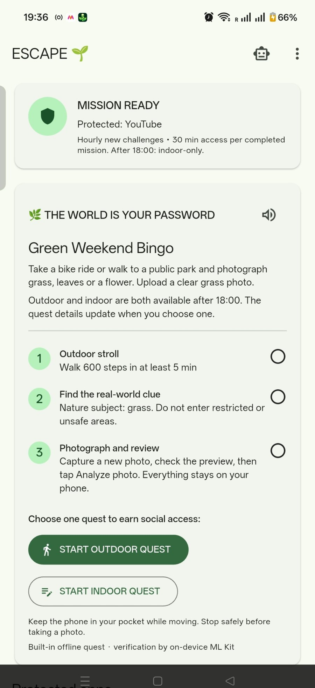
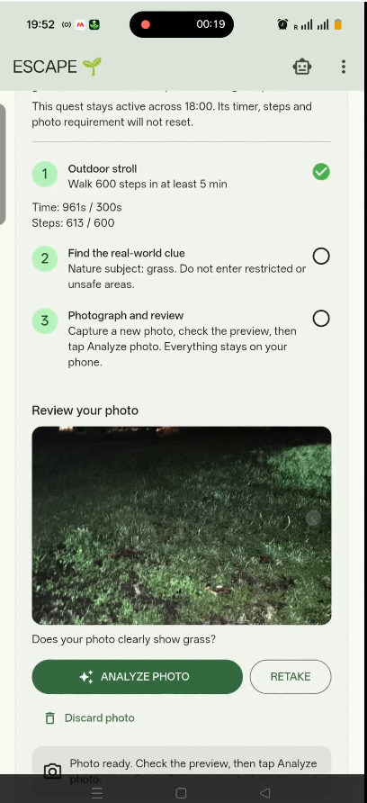
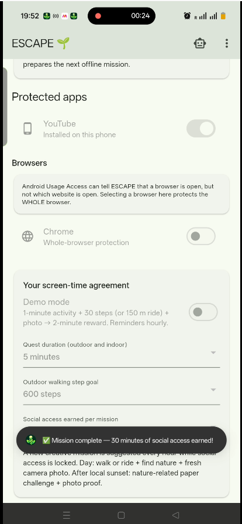

# ESCAPE 🌱 — The World Is Your Password

**Less scrolling. More strolling.** An experimental Android app that encourages you to step outside before returning to social media. Built for the [Hacktoberfest 2026 Touch Grass challenge](https://dev.to/challenges/hacktoberfest-week1-2026-10-05).

## How it works

1. **Walk:** Start an outdoor quest and complete its time/step goal.
2. **Discover:** Find the nature clue — grass, trees, flowers or water.
3. **Capture → Preview → Analyze:** Take a new photo. If the on-device image check approves it, earn a limited social-app access window.

### ESCAPE in Action

<table>
  <tr>
    <td align="center" valign="top">
      <b>1. Youtube blocked</b><br><br>
      
    </td>
    <td align="center" valign="top">
      <b>2. Outdoor Quest</b><br><br>
      
    </td>
    <td align="center" valign="top">
      <b>3. Walking Progress</b><br><br>
      
    </td>
  </tr>
  <tr>
    <td align="center" valign="top">
      <b>4. Photo Preview</b><br><br>
      
    </td>
    <td align="center" valign="top">
      <b>5. Photo Analyzing</b><br><br>
      
    </td>
  </tr>
</table>

## 🎬 Watch ESCAPE in Action

See how ESCAPE encourages outdoor exploration and rewards real-world adventures.

- 🌿 [Demo 1 — Social App Blocking & Outdoor Quest](https://youtube.com/shorts/wxvO3ALlOps)
- 📸 [Demo 2 — Offline Nature Photo Verification](https://youtube.com/shorts/SSaOgFDI9xg)

Both recordings were captured on a real Android device. Nature-photo analysis was tested without internet connectivity.

*Screenshots from an Android phone test; the demo uses shortened mission targets.*

## More adventures

- **Weekends:** Optional cycling challenges, park discovery and mapped cycleway segments. Finding new places needs internet; saved results can be reused offline.
- **Before 6 PM:** Outdoor quests only. **After 6 PM:** Choose either an outdoor quest or an indoor nature-inspired activity. A mission already underway continues across 6 PM.
- **Offline missions:** Local Gemma 3 1B generates creative text prompts, while bundled ML Kit analyzes photos on-device. Gemma does **not** visually inspect the image itself.

## Demo and code

- [Project showcase](https://ahitagni07.github.io/escape-digital-detox/) — an informational website, not the Android app.
- [GitHub Actions checks](https://github.com/Ahitagni07/escape-digital-detox/actions)
<!-- After publishing the video, add a Watch Demo link here. -->

## Run on Android

Requires Flutter, Android SDK and an Android device with USB debugging. From the repository root:

```bash
flutter pub get
flutter run
```

Grant the requested Android permissions for app usage, overlays, physical activity and notifications. Location is optional for weekend exploration and cycling. In **Local AI setup**, import/download the compatible Gemma `.litertlm` model once (it is distributed separately from the APK). Without Gemma, fallback quests remain available.

## Privacy and limitations

ESCAPE processes mission photos on the device; it doesn't run a photo-upload backend. On-device inference and photo checks can work without internet once set up. Downloading the model and searching for new places need internet. Steps and image labels aren't tamper-proof evidence; background blocking behavior varies by device. ESCAPE is a voluntary wellbeing prototype, not parental-control or safety software. Don't use the camera while walking or cycling.

**Tech:** Flutter, Kotlin, Gemma/LiteRT-LM, ML Kit, Android sensors, OpenStreetMap. **License:** MIT for the app code; model weights have separate license terms.
