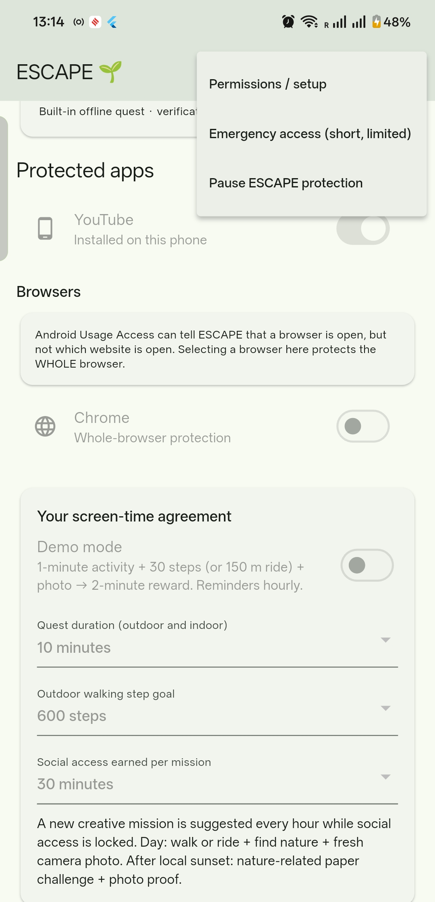
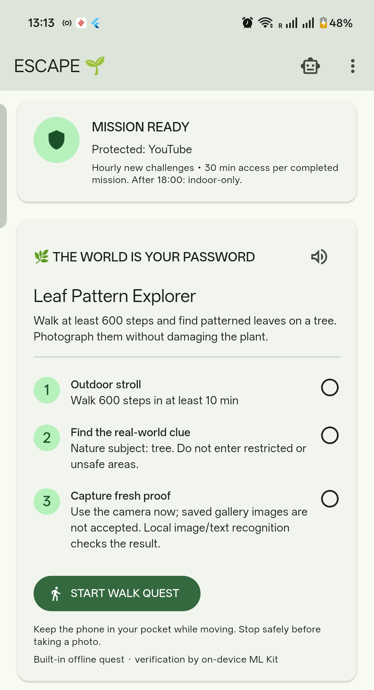
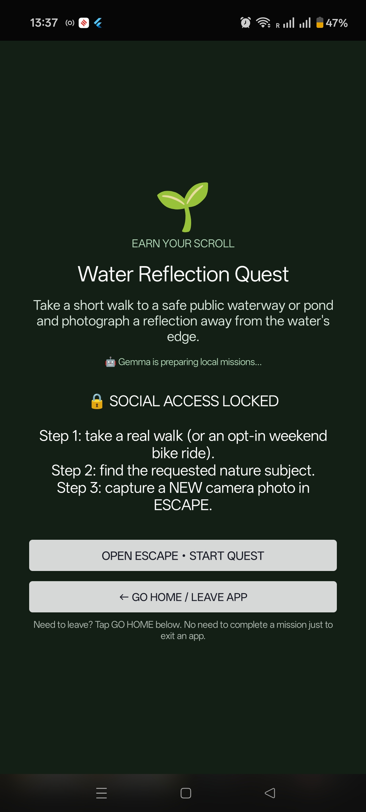

# ESCAPE 🌱 — Less scrolling. More strolling.

**The world is your password.** ESCAPE is an experimental Android digital-detox app that encourages you to step away from social media and do something real before you scroll again.

Built for the **Hacktoberfest 2026 Touch Grass** challenge, with privacy-first, on-device AI.

## How it works

1. **Choose the social apps** you want ESCAPE to protect.
2. **Earn your scroll:** complete a short walking quest, find the nature clue (grass, a tree, a flower or water), and take a **fresh photo** inside the app.
3. **Unlock temporarily:** ESCAPE checks your movement and photo **on your phone**, then grants a limited social-media window (30 minutes by default).

**More ways to escape**

- 🚲 **Weekends:** choose an optional bicycle quest or discover nearby parks and cycleway segments. Nearby search requires internet; saved results can be reused offline.
- 🌙 **After dark:** try a nature-inspired paper activity at home and photograph the finished work instead of going out at night.
- 🔔 **Gentle reminders:** receive new mission ideas hourly while protection is active, rather than constant notifications.

## App screenshot

<p align="center">
  
</p>
<p align="center"><em>Youtube is blocked.</em></p>

<p align="center">
  
</p>
<p align="center"><em>Walk quest</em></p>

<p align="center">
  
</p>
<p align="center"><em>Blocked social app — while opening youtube or instagram or facebook</em></p>

## Try it on Android

This repository currently provides **source code**, not a published app-store release. To run it, install Flutter and the Android SDK, connect an Android phone with USB debugging enabled, and run:

```bash
flutter pub get
flutter run
```

On first launch, follow the in-app setup for **Usage Access**, **Display over other apps**, **Physical Activity**, and **Notifications**. Location is optional for cycling and nearby exploration. You can enable **Demo Mode** to try a short quest.

For creative offline missions, import the compatible **Gemma 3 1B `.litertlm` model** through **ESCAPE → Local AI setup**. The model is separate from the APK; without it, the app can use its built-in fallback missions. Model downloads and nearby place searches require internet, but the core quest, image checking and installed-model inference run locally.

## Privacy and limitations

ESCAPE has **no application backend** for mission data or photographs. It uses local Android sensors, **Gemma 3 1B** for mission text, and **ML Kit** for offline photo checks. Photo recognition and step/GPS measurements are approximate, so approval is not proof that someone physically touched grass. Android may restrict background monitoring; this is a voluntary wellbeing prototype, not a tamper-proof blocker. Never take photos or use your phone while cycling in unsafe conditions.

**Built with:** Flutter · Kotlin · LiteRT-LM / Gemma · ML Kit · OpenStreetMap

**License:** [MIT](LICENSE) (model weights have separate license terms).
